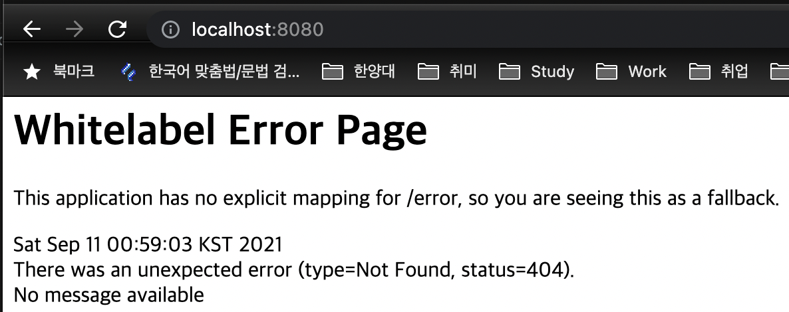

  

# Project

## Dependencies

```groovy
dependencies {
	implementation 'org.springframework.boot:spring-boot-starter-web'       // (1)       
	implementation 'org.springframework.boot:spring-boot-starter-security'  // (2)
	implementation 'org.springframework.boot:spring-boot-starter-data-jpa'  // (3)
	implementation 'org.springframework.boot:spring-boot-starter-actuator'  // (4)
	implementation 'org.springdoc:springdoc-openapi-ui:1.5.10'              // (5)
	compileOnly 'org.projectlombok:lombok'                                  // (6)
	developmentOnly 'org.springframework.boot:spring-boot-devtools'         // (7)
	runtimeOnly 'com.h2database:h2'                                         // (8)
	runtimeOnly 'org.mariadb.jdbc:mariadb-java-client'                      // (9)
	annotationProcessor 'org.projectlombok:lombok'                          // (6)
	testImplementation 'org.springframework.boot:spring-boot-starter-test'  // (10)
	testImplementation 'org.springframework.security:spring-security-test'  // (10)
}
```

> (1) for web features  
> (2) for security: authentication, authorization  
> (3) for jpa  
> (4) for monitoring  
> (5) for documentation  
> (6, 10) for lombok  
> (7) for devtools  
> (8) for local database  
> (9) for remote database  
> (10) for test

## How to start

1. Run application.
2. Open http://localhost:8080 in a browser (like chrome, safari, etc).
3. Enter username as "user" and generated password in log below.
    ```text
    2021-09-11 00:56:47.850  WARN 34029 --- [  restartedMain] JpaBaseConfiguration$JpaWebConfiguration : spring.jpa.open-in-view is enabled by default. Therefore, database queries may be performed during view rendering. Explicitly configure spring.jpa.open-in-view to disable this warning
    2021-09-11 00:56:48.785  INFO 34029 --- [  restartedMain] .s.s.UserDetailsServiceAutoConfiguration :
    
    Using generated security password: 2e674be7-1207-4d2d-aabd-d3d2d599e0fa
    
    2021-09-11 00:56:48.833  INFO 34029 --- [  restartedMain] o.s.b.a.e.web.EndpointLinksResolver      : Exposing 1 endpoint(s) beneath base path '/actuator'
    ```
4. Then you can check the white error page.



> ⚠ **Warning**: This is because nothing has been developed yet, and if it is developed later, other pages may be exposed or operate with different functions.